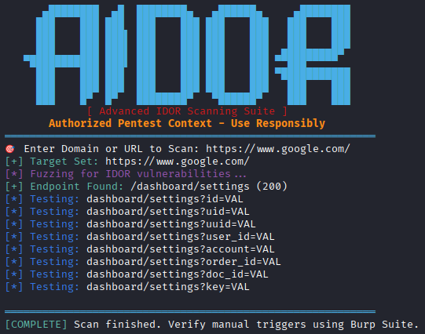

# AIDOR 👁️ - Automated Insecure Direct Object Reference Detector


<p align="center">
 
  
</p>

**AIDOR** (Automated IDOR Detector) is a professional Bash utility for **authorized penetration testers** to identify **Insecure Direct Object Reference (IDOR)** vulnerabilities in web applications. Detects numerical IDs, parameter patterns, and performs automated enumeration tests.

## 🔍 What is IDOR?

**Insecure Direct Object Reference (IDOR)** occurs when an application exposes internal object references (like `user_id=123`) without proper access control validation, allowing attackers to manipulate parameters and access unauthorized data.
## 🚀 Features

| Feature | Description |
|---------|-------------|
| 🔍 **Parameter Detection** | Identifies 10+ common IDOR-prone parameters |
| 🎯 **Numerical Enumeration** | Auto-tests ID+1, ID-1, 0, 1, 1000 |
| 📊 **HTTP Status Analysis** | Detects 200 (SUCCESS), 403/401 (ACCESS DENIED) |
| ⚡ **Zero Dependencies** | Only requires `curl` (pre-installed on most systems) |
| 🎨 **Visual Reporting** | Color-coded results with ASCII banner |

## 📋 Prerequisites

```bash
# Install curl (usually pre-installed)
sudo apt update && sudo apt install curl -y    # Debian/Ubuntu
sudo pacman -S curl                           # Arch Linux
```
## 🛠️ Installation
### 🌐 Method 1: Git Clone
```bash
git clone https://github.com/YOURUSERNAME/AIDOR.git
cd AIDOR
chmod +x aidor.sh
./aidor.sh
```
## ⚠️ ⚠️ IMPORTANT DISCLAIMER ⚠️ ⚠️
🔴 FOR AUTHORIZED PENETRATION TESTING ONLY
🔴 DO NOT SCAN SYSTEMS WITHOUT WRITTEN PERMISSION
🔴 AUTHOR IS NOT RESPONSIBLE FOR MISUSE
🔴 ENSURE COMPLIANCE WITH LOCAL LAWS
brew install curl                             # macOS

